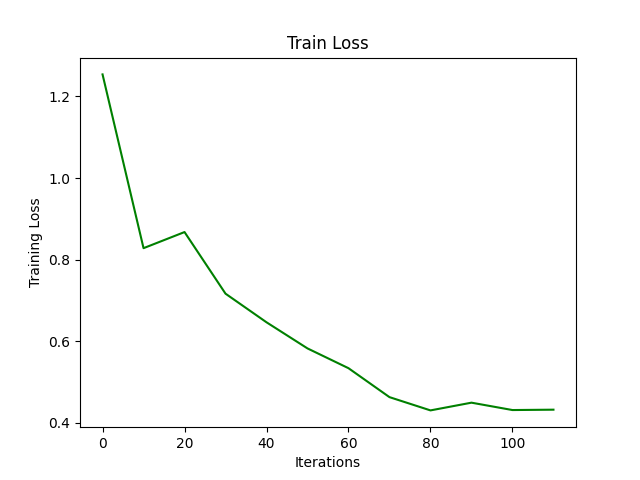

# Parametric Grover and Quantum Attention Mechanism
In this project, I focused on implementing the GKHAN architecture described in [GQHAN: A Grover-inspired Quantum Hard Attention Network](https://arxiv.org/abs/2401.14089), and evaluated its performance on the MNIST and FashionMNIST datasets.

## Model Architecture

The GQHAN model is divided in three blocks, a first block that encodes the input image in a combination of quantum basis states using amplitude encoding. Now following the idea of the Grover's algorithm a parametrized version of the Oracle and the Diffusion Operator are defined to search and amplify the quantum states that are more salient to classify images. Finally the sign of the expectation value on the last qubit is taken as prediction for the class.

### Flexible Oracle

The Flexible Oracle is composed by a sequence of controlled gates, the qubit 0 is used as an ancillary qubit and control the phase flip of the remaining qubits. Before and after each controlled gate a rotation rx(theta) is applied on qubit 0 to activate or not the inversion. Each gate is defined as 'I ⊗ |0⟩⟨0| + Λ(b) ⊗ |1⟩⟨1|'  where Λ(b) is the diagonal matrix identity matrix with -1 in the b-th element of the diagonal. These gates are generated in PennyLane using a custom function:
<pre> <code> def make_controlled_flip(bitstring): 
    def controlled_circuit(): 
        qml.ctrl(lambda: qml.FlipSign(bitstring, wires=[1,2,3]), control=[0])()   
        return controlled_circuit 
</code> </pre>

In my case (working with 4 qubits) this is represented mathematically by 16x16 unitary matrix, like I show below for the state 011:
  

 
This matrix represents the gate when b is 3. 
 Finally the Flexible Oracle is defined by concatenating all the gates for each possible basis state and adding rotations on qubit 0.
<pre> <code>
def flexible_oracle(theta):
    keys = list(controlled_dict.keys())
    for i in range(8):
        qml.RX(theta[i], wires=[0])
        controlled_dict[keys[i]]()
        qml.RX(-theta[i], wires=[0])
</code> </pre>
 

### Adaptive Diffusion Operator

The parametric diffuser is introduced as a flexible alternative to the standard Grover diffuser. Instead of relying on a fixed symmetry axis  |In> and Pauli-X gates, this version replaces the Pauli-X operations with parametrized CRY gates, allowing the symmetry axis to be learned rather than fixed. 
Below I include both the implementation code and the plot of the resulting quantum circuit.

  

  

## Experimental Results

This section presents a comparative analysis of the results obtained by varying hyperparameter configurations and introducing architectural modifications to the model.

### Datasets
Two widely adopted benchmark datasets are used, Fashion MNIST and MNIST, both datasets consist of 70000 grayscale 28x28 images. 550 images with label 0 and 550 images with label 1 are selected from the dataset, then PCA is applied to reduce the dimensionality of each image to 8 features that are encoded on 3 qubits with amplitude embedding. Using PCA in this way severe image compression results in the loss of a significant amount of critical information, presenting challenges in image classification.
 
<pre> <code>
    fashion_mnist = fetch_openml('Fashion-MNIST', version=1, as_frame=True)

    pca = PCA(n_components=n_features)
    scaler = StandardScaler()

    y_0 = fashion_mnist.target[(fashion_mnist.target == '0')].sample(n=n_samples, random_state=1)
    y_1 = fashion_mnist.target[(fashion_mnist.target == '1')].sample(n=n_samples, random_state=1)

    X_0 = fashion_mnist.data.iloc[y_0.index]
    X_1 = fashion_mnist.data.iloc[y_1.index]

    y_0 = y_0.to_numpy(dtype=np.int_)
    y_0 = y_0 - 1
    y_1 = y_1.to_numpy(dtype=np.int_)

    X_train = np.concatenate((X_0[:n_samples-n_test_samples], X_1[:n_samples-n_test_samples]))
    y_train = np.concatenate((y_0[:n_samples-n_test_samples], y_1[:n_samples-n_test_samples]))
    X_train, y_train = shuffle(X_train, y_train, random_state=1)

    X_test = np.concatenate((X_0[-n_test_samples:], X_1[-n_test_samples:]))
    y_test = np.concatenate((y_0[-n_test_samples:], y_1[-n_test_samples:]))
    X_test, y_test = shuffle(X_test, y_test, random_state=1)

    X_train = pca.fit_transform(X_train)
    X_test = pca.transform(X_test)

    X_train = scaler.fit_transform(X_train)
    X_test = scaler.transform(X_test)
</code> </pre>
 
 Some images from the FashionMNIST dataset
  

  

### Training Loss and Accuracy

 As an initial experiment, I aimed to replicate the results reported on the FashionMNIST dataset in the original paper. The quantum neural network consists of seven layers of the GQHAN architecture, with parameters shared across all layers, resulting in only 14 trainable parameters in total.
The model is trained for 120 iterations using Nesterov Gradient Descent, with a batch size of 30 and a learning rate of 0.09. 
  

  
  

 Training loss, training accuracy, and test accuracy were recorded every 10 iterations. After 120 training steps, the model achieved a test accuracy of 0.90 and a training accuracy of 0.93. These results differ significantly from those reported in the original paper, despite using the same configuration as proposed.
In the following section, I present some of the results obtained by modifying the network and experimenting with different configurations of interest.

### Num Layers

 Here, I reduced the size of the model by training the quantum neural network with 5 layers (left plot) and 1 layer (right plot) instead of 7. I observed that the model achieves comparable performances. However, in the case where only one layer is used, the training accuracy is lower than the test accuracy, suggesting that there is still room for improvement. This is also supported by the fact that the training loss is higher compared to the case with more layers. 

  
  

  
  

### Overparametrize the Model

 In this experiment, I implemented an overparameterized version of the network by assigning a distinct set of parameters to each layer, rather than sharing the same 14 parameters across the 7 layers.
  

  
  

 In this case, I was able to achieve a lower training loss and increase the test accuracy to 0.93. However, it is important to note that this comes at the cost of increased model complexity. With 14 parameters, it was possible, looking at the parameters selected for RX rotation,  to interpret which basis states were identified as important features once the model was trained. Now, with 92 parameters, such interpretability is no longer practical.

### Modified Diffusion Operator

 In the original Grover's algorithm, the diffusion operator plays a key role in amplifying the probability amplitude of the marked state. This operator is constructed using X gates and Hadamard gates to perform a reflection about the mean of the state vector. Inspired by this structure, I introduced a version of the model with a different adaptive diffusion operator by replacing Controlled RY with controlled RX rotations.

 The results in terms of accuracy are similar to the RY gate but training loss is higher.
  

  
  

### Reducing Parameters

 To explore the trade-off between model complexity and performance, I introduced variations that reduce the number of trainable parameters in either the flexible oracle or the adaptive diffuser.

* Flexible Oracle Simplification:
  In this variant, the RX gate is applied after every pair of controlled-Λ gates, effectively grouping input features in pairs. This architectural change reduces the model's expressivity, as it groups together the features.

* Diffuser One Parameter:
  Here, the flexible oracle remains unchanged, but the diffuser is modified to use a single shared parameter across all CRY gates. This significantly increases the rigidity of the diffusion operator, limiting its adaptability during optimization.

 Results for flexible oracle:
 

  
  

 

 Results for one parameter diffusion:

 

  
  

  

These variants help analyze the model’s robustness parameters constraints and its capacity to generalize under reduced expressive power. In the first case I find interesting that similar results are obtained using only 4 feature instead of eight, suggesting that the data can be ulteriorly compressed without a significant loss in performance. In the second case to reach 0.9 accuracy requires more training steps, maybe because the reduced parameter space offers fewer local minima for the optimizer to exploit.

